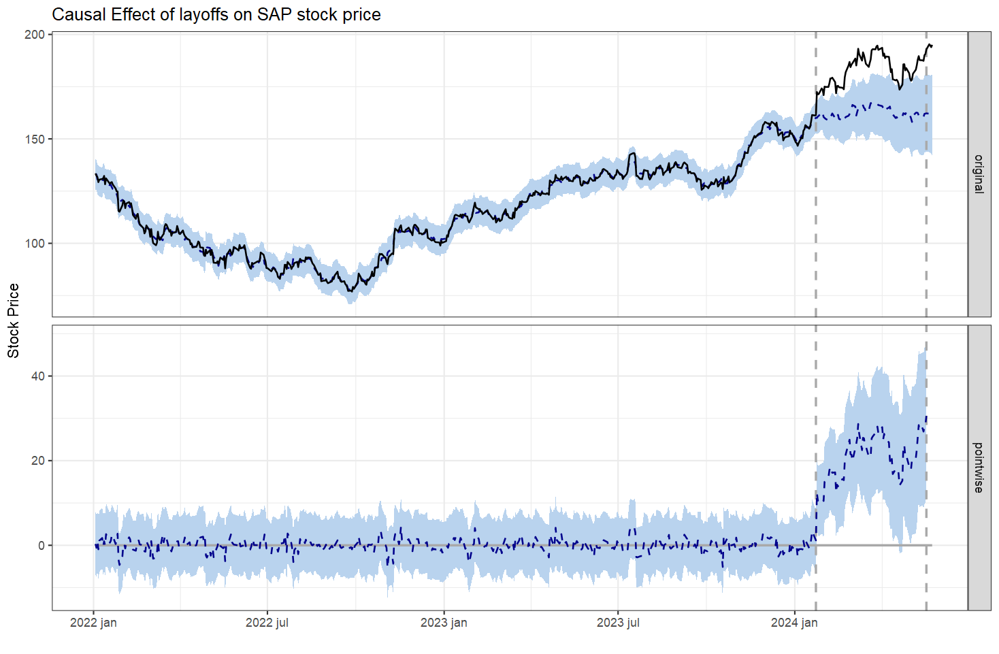

# Using Causal Inference to quantify layoff impact on stock price
Originally as this blog post in my personal blog:

## Goal
SAP is a huge world-leading software company, and even world-leading companies apparently go through rough patches and reestructuring, as it has happened with SAP over the past few years. 
Part of this process included a major layoff of 6.000 people in January 2024. The market responded quite positively, with their stock price on the NY Stock Exchange going up a few percent over the following weeks (and it hasn't gone down since).
Was the layoff causally related with the uptick in stock price? Or was it just a coincidence?
We're gonna use Causal Inference estimation methods to identify and measure the impact of this particular layoff on their stock price, if there was any at all.

## Result
Thanks to Google's `CausalImpact` R package and some correlated stock as predictors, we calculate a posterior probability of causal effect of 99,89%. 😎

[Data](https://github.com/rafabelokurows/layoffs_stock_price/tree/main/data)  
[Code](https://github.com/rafabelokurows/layoffs_stock_price/blob/main/causal_impact_layoffs_stock_price.R)

## Tools
R and a few of its packages:
* [CausalImpact](https://github.com/google/CausalImpact)
* [MarketMatching](https://github.com/klarsen1/MarketMatching)
* [tidyquant](https://github.com/business-science/tidyquant)

